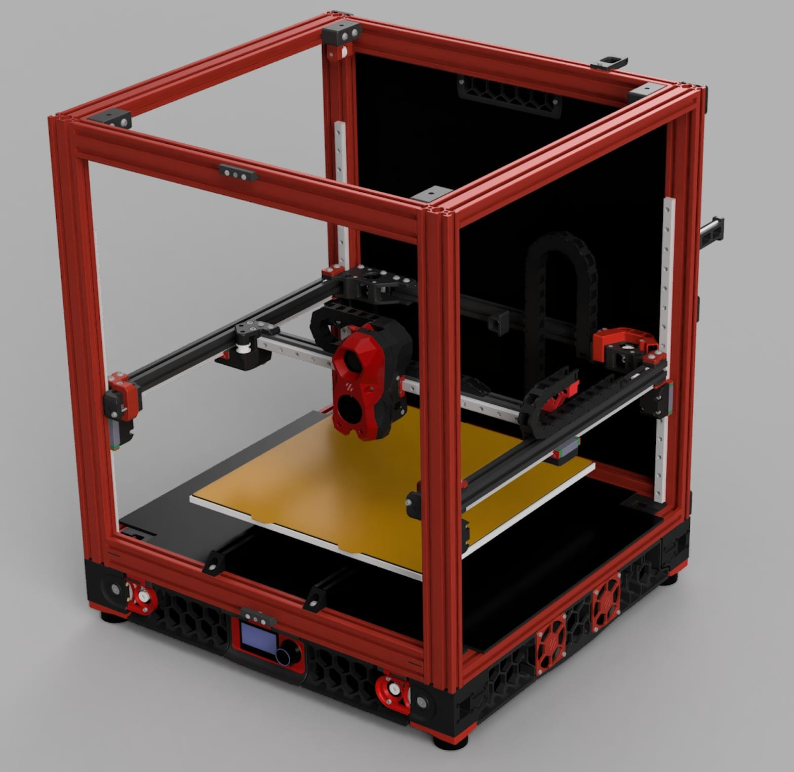

# deathcube
Alternative branch of Voron 2.4r2 with 2040 profiles and MGN12H rails.

This is not a fully itereated project. But it works on CAD :D

Why we did that? Because we built other printers in the past, and we have a lot of time and spare materials.

# Project Goals
- Use 2040 Frame Members
- Use standard Voron 2.4r2 standard profile lenght, but 2040.
- Use MGN12H 400mm on all the rails (including X,Y,Z)  
- Minimize the  the minium Voron Community parts. 
- Build Volume of ~350^3 mm (350x350x˜330)
- Every modified part, must follow the VORON design rules (chanfers, fillets, and aesthetics) 
- Include some well-known mods:
  -  GE5C Mod. Bearings Mount on every z. https://github.com/VoronDesign/VoronUsers/tree/main/printer_mods/hartk1213/Voron2.4_GE5C
  -  Pinholes Mod. https://mods.vorondesign.com/details/C8XJJ0fBGfBFKQZctjKeA  

# Opportunities to improve:
- The Y rails of the flying gantry, need to be shortened 6mm (final lenght 394mm on the MGN12 rails)
- Include the A/B Drivers with pinholes (they are the standard ones)
- Include a mod for the front idlers (some of the mod ones are better than the standard)
- Include Klicky-Probe or Annex Beacon on the toolhead. 

# Parts that were modified: 
NOTE: Every part not being modified, must be printed from the original Voron 2.4r2 repo, since it could be outdated.
- Z Belt Drive A and B (Just body1), they are 20mm larger, and the foot position also were moved.
- Z Joints GE5C were upgraded to hold the MGN12H cartridge.
- XY Joint Left and Right (from the X-Axis) were modified, inspired on https://github.com/hammered-github/B2V
